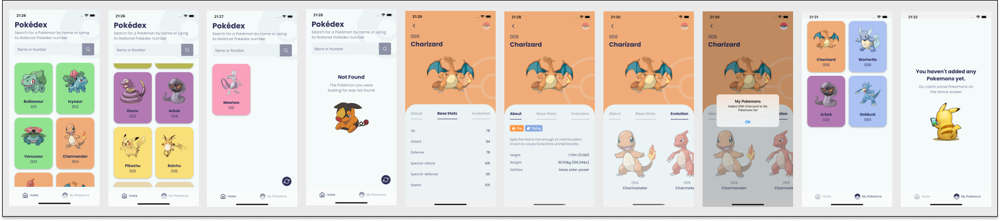

<h1 align="center">
  Pokédex
</h1>

<h6>
App desenvolvido em React Native, que faz a listagem e a procura de todos os pokémons que existem oficialmente na Pokédex,
foi utilizada a API pública <a href="https://pokeapi.co/">Poké API</a> para o consumo dos dados
</h6>

## :rocket: Como executar

<ul>
  <li>Clonar o projeto</li>
  <li>Instalar as depêndencias usando <strong>yarn</strong></li>
  <li><strong>iOS:</strong> instalar pod install, <strong>cd ios && pod install && cd ..</strong></li>
  <li>Executar comando <strong>yarn start</strong> no diretório raiz</li>
  <li>Em outro terminal, também no diretório raiz, executar <strong>yarn android</strong> ou <strong>yarn ios</strong></li>
</ul>

## :speech_balloon: Funcionalidades

<ul>
  <li>Listagem de Pokémons</li>
  <li>Busca de Pokémons por Nome/Número</li>
  <li>Tela de detalhes com informações sobre o Pokémon</li>
  <li>Adicionar Pokémon como favorito</li>
</ul>

## :iphone: Recursos Aplicados

<ul>
  <li>Navegação entre páginas</li>
  <li>Async Storage</li>
  <li>Criação de compoentes com Styled Components</li>
  <li>Loading feito com Lottie</li>
  <li>Consumo de API</li>
</ul>

## ⌨️ Tecnologias

<ul>
  <li>React Native</li>
  <li>TypeScript</li>
  <li>React Navigation</li>
  <li>React Native Fast Image</li>
  <li>React Native Splash Screen</li>
  <li>React Native SVG</li>
  <li>Styled Components</li>
  <li>Lottie React Native</li>
  <li>React Content Loader</li>
  <li>React Native Responsive Fontsize</li>
  <li>Axios</li>
</ul>
